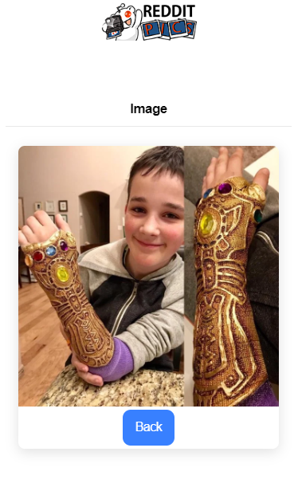

# Ionic-Vue


## This is a basic remake of content from the first page of https://www.reddit.com/r/pics made through Ionic-Vue an app development platform and Axios a promise based HTTP client


# *Technologies Used* #

* Vue.js
* Javascript
* CSS
* Ionic-Vue
* Ionic-Core
* HTML
* Axios
* Vue CLI

# Screenshots #





## *Known Issues & Bugs* ## 

* Any current issues with Ionic Vue 
* Some posts do not contain a thumbnail image

## Project setup
```
npm install
```

### Compiles and hot-reloads for development
```
npm run serve
```

### Compiles and minifies for production
```
npm run build
```

### Run your tests
```
npm run test
```

### Lints and fixes files
```
npm run lint
```

### Customize configuration
See [Configuration Reference](https://cli.vuejs.org/config/).

## *Support and contact details*
Contact: Kenneth Du, kennethdu3@gmail.com


